# BabyHeap

## Background

To start this off I first saw the initial tweet on the previous day and thought it would be a cool opportunity but thought I would be out of contention as UTC 0800 is 2 AM for me. So I thought I would wake up and see the challenge already finished, but to my surprise the challenge had not been released yet, meaning that I had a chance when it was probably released at 2 PM. Looking at the previous tweets we see some hints of what may be ahead.

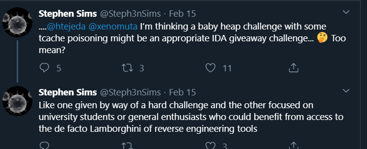

So we have an idea of what we should be looking for and how to approach it. The reason I say this is that with TCache, libc 2.26 and newer, there are a common few attacks that will work.

## Starting

2PM hits and we finally get the release of the challenge, the binary can be found at bit.ly/sec760babyheap, and the remote connection at nc babyheap.deadlisting.com 5760

Pulling the binary we get a file with these security perminssions:

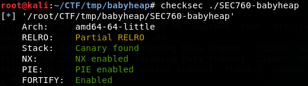

Running the binary we are given a initial task as a "Proof of Work"

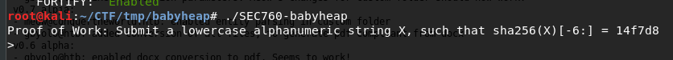

## Reversing

Looking into the binary we get into main and find the first function call to 0x1B90

We see what appears to be some setup with srand, then a loop where we create a random byte, we can assume a lowercase alphanumeric byte range as well based on the challenge.

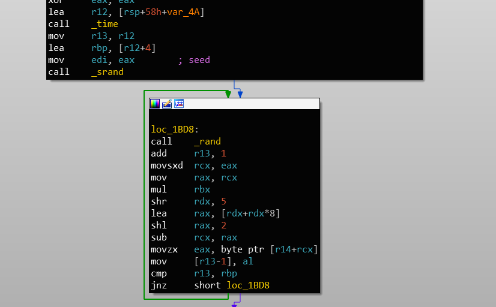

Then the string is sent to function 0x1AD0 where we have several calls to different SHA256 functions, so this is where the SHA256 string is created. Next the title is printed and our input is read in through 0x16D0, so we will call this function read_0 from now on. Our sent in string is sent to the SHA256 function and finally our strings are compared. Where if we fail the program ends or we continue onto the menu. For me it is not obvious the number of characters that were created in the loop previous so I needed to step through in GDB to find out the string is only 4 characters.

With 4 characters [a-z0-9] we are left with 36^4 possibilities, Now we could try and sync up our clock and figure out what characters will be created, but there is too much volatility with that when going over a network connection to a server you don't know the exact time it is set to. So instead I decided the brute force method.

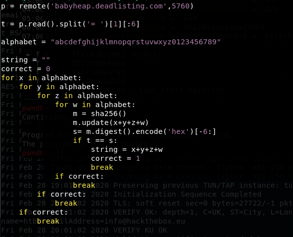

Here my *elegant* method is to just test every possibility, until we get a match after we send the correct code in we are finally greated with the program:

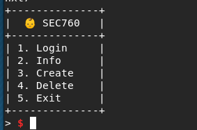

Here we can see the options, but more importantly we can match the functions now
1. 0x1640 = Menu
2. 0x1720 = Get_Int
3. 0x1910 = Login
4. 0x1A40 = Info
5. 0x17A0 = Create
6. 0x1870 = Delete

Messing around with the input a bit we see that we are not allowed to interact with any of the options without logging in first.

Trying to login we find that a username and password combo are asked for, well what happens with 'aaaa:aaaa'

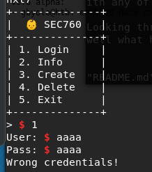

Looking through the function we find one function call that sticks out at 0x13B0, going into it we find that this function is a bit complicated and while it could be useful to reverse we don't have the time to concern ourselves with it. Lets look at the memory actually compared and see if we recognize it.

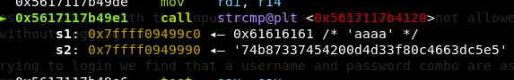

That isn't the password we sent in but it does happen to be the correct size for a common hashing algorithm, MD5. Running a check we are correct in our assumtion:

What is happening is that our username is being hashed and compared to the password sent in, a little hard to tell based on sending both 'aaaa' in as username and password.

Anyways now we can login and start to PWN this challenge.

Now we can skim the other functions given to us, looking through info function we see some a weird activity of *__free_hook* being resolved then just our name being printed with *__printf_chk*. A bit of background printf_chk is just like normal printf but is supposed to be secure by having some checks into what format strings are allowed, ie no '$', but this does not stop us from leaking what is on the stack already. By sending in a craftier username such as '%p %p%p%p%p%p%p%p%p %p' we get a succesful leak.

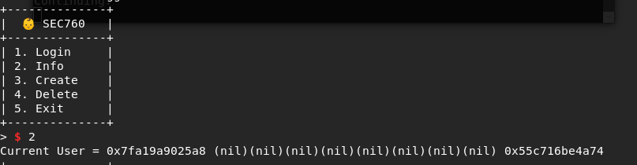

Now that we have a leak we have the base program address and libc base, at this point we still don't know what we will need to accomplish to get execution but having the address of the free_hook is a good indicator of a target

During the actual developing of the exploit I didn't really look at the Create function except for a quick scan, all I saw was that we sent in a number, that size was allocated, and that we read into it with read. Other than that nothing stuck out so I went to the Delete function, but I had one check in mind for that function. Does our freed object get zeroed out, after noticing it did not I had a good understanding of what needed to be done, just needed to check it.

## Heap

Now let's get a little understanding of how the heap works first, when a program asks for a chunk of memory through a malloc, realloc, calloc, etc. Some is probably provisioned through a page assigned to the program, what we care about is the structure assigned to the heap chunk given to us:

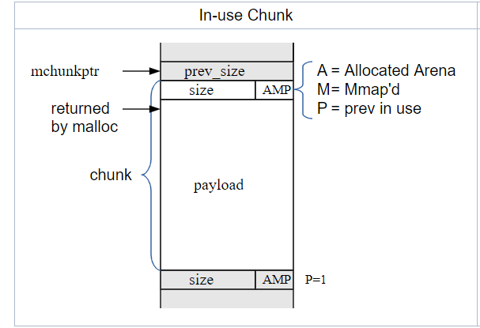

Here is a picture I ~~stole~~ found at https://sourceware.org/glibc/wiki/MallocInternals, where you can get a better understanding of the heap than what I am going to give you. As the picture shows there will be a value corresponding to the size of the chunk, whether the previous is in use or not, then the data, then the next chunk and so on. With tcache when a chunk is freed instead of performing some previous heap magic the size is checked, from there the address we want freed is added to a linked list for that specific size. Allowing for like sized chunks to be allocated faster, the problem for this is that the pointer to the next location in the list is stored in the first 8 bytes of the chunk. Meaning if we are able to overwrite the pointer we can get an arbitrary allocation wherever we want. 

Now we are in a slight bind though, depending on what libc verison we are using our exploit could differ. With libc-2.27, there is no check for if a double free occurs meaning we could free once and free again, already giving us the arbitrary allocation. In libc-2.29 it changes, there is now a check for if a chunk has already been freed meaning we can't just get a simple double free, unless we are able to fool free.

At this point since no libc was given to us we don't really know which method to approach unless we check our free_gadget running the remote version and checking the offset of free_gadget shows up at gives us the answer. By using the last 12 bits of the address we can figure out what libc version we are using with libc.blukat.me:

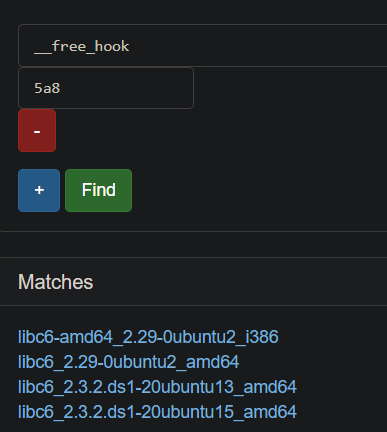 

With us being confident with the library we can now continue on.

## Exploit
Since libc-2.29 has checks for the double free we will need to either get an overlapping chunk or free the same chunk twice for different sizes. It may sound harder but in fact the second option is the easier of the two, most of the time. The trick lies in the way that libc figures out what size we are working with. If you reference back to the heap image, since chunks are right next to each other, if we can get an overflow of input we can spoof the size we are working with. So lets test this theory out, by creating two chunks of 24 bytes in size we get something like this on the heap:

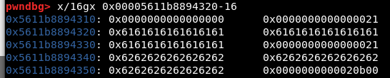

If we delete the second chunk, then the first chunk, our Tcache list looks like this:

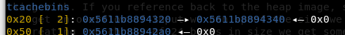

Meaning the next allocation of that size should give us the first chunk again, and when we send in 24 'c's we get this:

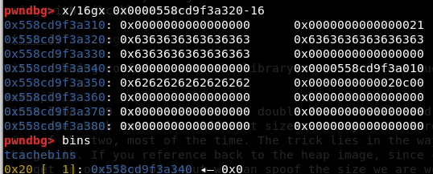

See how the second chunk is still on the list but the size location is now zero, this is because we have a null byte overflow. If we deleted index 2 again, since we still control the pointer to it, we would get the location put in a different location on the TCache list. Now this was just a POC and would crash since a size of zero is not valid but what if the started as a size of 0x110? This would allow us to free it once to 0x110 then overwrite it and free it again to a size of 0x100!

Meaning we will have full control of the tcache list. So here is what our exploit will look like:
1. Create 3 chunks, size of 24, size of 0x108 (becomes 0x110), and a size of 0xf8 (becomes 0x100)
2. Delete all three of these chunks
3. Recreate the size of 24 and overflow the chunk of 0x110 to look like 0x100
4. Delete the second chunk again so the location shows up in two different lists
5. Create a chunk with a size of 0x108, and make the first 8 bytes equal to free_hook
6. Create a chunk of 0xf8, makes free_hook the next item in the list
7. Create a chunk of 0xf8, overwrite free_hook with a one_gadget
8. Free any of them to get a shell!

For those who don't know what a one_gadget is, this will be a location in libc when called, if certain parameters match, will execute /bin/sh without any further guidance. Another note the reason I create and delete a chunk of size 0x100 right away, is because the TCache pointer has a counter indicating how many items are supposed to be on the list, if we don't include this our free_hook will never be accessed as the program does not know that there is anything on the list

This is where we run into a slight problem, since we don't have the correct libc used it is a bit harder to find a one_gadget that works since we can't break at free_hook with gdb to test the parameters. My local version of Kali uses a slightly different libc that has different offsets for everything compared to the remote system, but lucky for us there is another site that helps us. Just like the libc lookup there is a one_gadget lookup as well, https://onegadget.me/, here we can send in the offset and we can find one_gadgets corresponding to the libc versions. 

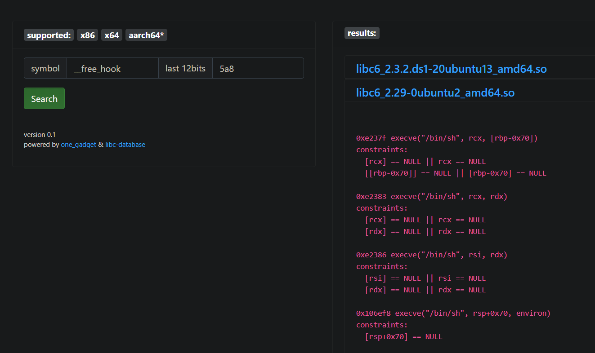

After some brute forcing and address adjustments we finally get a shell with the last gadget, 0x106ef8

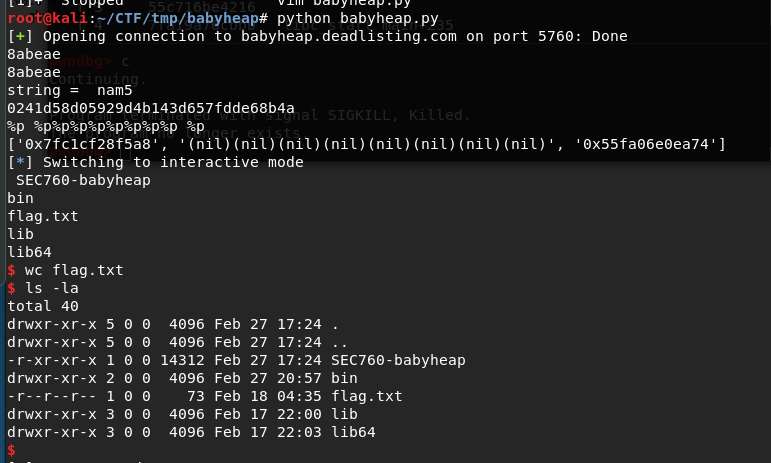

