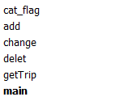
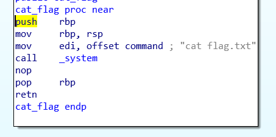
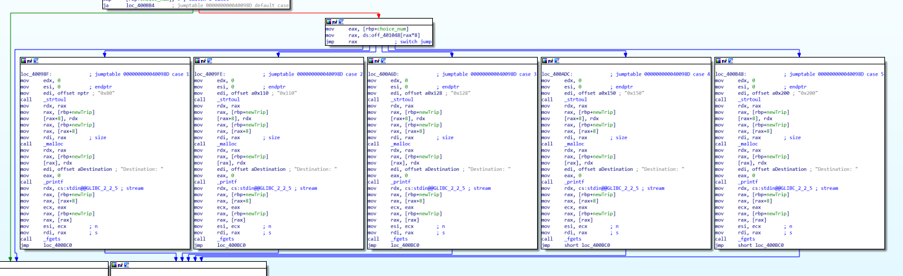
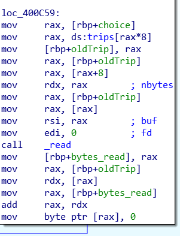
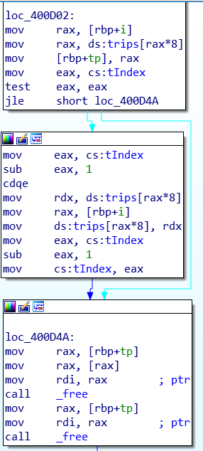
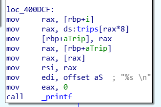
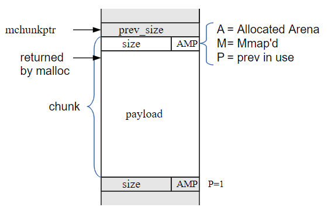

# Travller

- Category: PWN
- Points: 200

## Challenge

### Description
> Great way to manage your trips, right? nc pwn.chal.csaw.io 1003

### Files

We are given two files to work with

> traveller (ELF 64-bit executable)
> libc-2.23.so (ELF 64-bit Shared Object)

## Investigate

Running the program we see that we are given a large number, either a memory address, libc, or a stack address and we have a menu with several options to choose from:

> We can:
	* Add a trip
	* Change a trip
	* Delete a trip
	* Check a trip

Adding a Trip lets you choose a size of options to create
Updating a Trip lets us change the data inside an already created trip
Deleting a Trip lets us delete a created trip
Check a trip prints the data of a created trip
Nothing seems too out of the ordinary here, so let's go to a dissasembler

## Disasembly

Looking at our function list we can see all of our options and our target:

We can also see in main that based on our input in the menu the corresponding function is called

### Cat_Flag
We have a small operation happening here with a system function being used on `cat flag.txt`

### Add 
First we have a compare between a tIndex and 7, tIndex is used as a counter for the current number of allocated trips, with one branch ending saying too many trips and another adding another trip. After we can see an initial malloc with a size of 0x10 then being stored in the local variable newTrip. We then see the add menu get printed then we have our choice with a switch statement for our option that we choose.

The choices only affect the size by the looks of it with all the code doing the same operations, of mallocing the size and reading our string. Our malloced chunck's location is stored in newTrip[0] and our size is stored in newTrip[1]. Finally tIndex is incrementd and newTrip is stored in the global trips array.

### Change
In Change we input the trip we want to change, that trip is loaded from the trips array into a local oldTrip, which will be the same set up as newTrip from Add. From here the size and pointer in oldTrip are used with a read to modify the data. One last important part that shows up at the end is that the total bytes read from read is used to set the next character to zero. This will be our attack vector later on.

### Delete
For Delete our choice to delete is loaded into local tp. After this the program grabs the last index in the trips array and moves it to our current deleted item.
> So this would mean that if I had four items and deleted trip 0, trip 3 now becomes trip 0. A little funky but an effective way to make sure everything is accounted for. 
Lastly the two malloc'd chunks are freed, with the string's location being freed first.

### GetTrip
Lastly we have get trip, nothing really happens here except that we are able to print out the string corresponding to the trip we want.

## Exploit
For someone who does not know what to look for it may take a bit to find the exploit. I already mentioned it up above but there is a one null byte overflow that we can execute on our string. This is mostly useless until they gave us the option to have data for 0x128 bytes. The reason that this is useful is because of the way the heap works and is layed out. 

For a quick rundown of what we will work with reference the picture above. Here the first 8 bytes will be a prev_size, the next 8 bytes will be used for the size with a plus 1 if the previous chunk is in use, then our value and the cycle continues. Technically the prev_size and size bytes are apart of the previous chunk allowing us to possibly modify our chunks.

Here we can see what the heap will look like after a trip of size 0x80 is added to our list. We have the first chunk with a total size of 0x20, with the string pointer and the size saved. Then our next chunk is a chunk size of 0x90 even though our size is only 0x80, this is because of the extra data that is needed by the heap, so a malloc of 0x80 will ultimately allocate 0x90 space. This holds true for most of the options in add except for 0x128, with this option only 0x130 bytes are used in the chunk. this allows us to ultimately set the last byte of the next size chunk to 0. From here we can mess with the next malloc'ed chunks. Lastly in the image above we have the last size of 0x204e1 this is the size remaining in our available chunk currently. We are not concerned with this currently.

So now that we have a rough understanding we now need to figure out how to get this done. Luckily [ShellPhish's how2heap](https://github.com/shellphish/how2heap) has a great example of using a null byte overflow to gain execution. Since one of the malloc'ed items holds a pointer, if we can figure out how to overwrite the pointer we can overwrite anything and gain execution. So by using the null byte above we will be able to malloc over a malloc'ed chunk and be able to write over it. To get this to work we will need to be able to change the malloc chunk size of a string we input. We can easily do this with our 0x128 bytes but the problem is that whenver we malloc a chunk the smaller item is always malloc'ed first and will get in our way. So we need to find a way to get past it.

My approach to this was to malloc two chunks first one with a size of 0x150 and the other with 0x128 we will call this second one A. Then delete the first chunk, this will free up the space for our next allocation of 0x110, now we have a space of 0x40 left to use which only the small chunks will be able to fit in. From here we allocate the chunk we want to change the size of we will call it B, with a size of 0x150 and set up the data for the fake size as well, this includes a fake prev_size and next size. Libc does special checks to make sure everything still matches up with free's and malloc's so we need to have a fake chunk data to fool it. From here we will add 2 more chunks one we will use to help fool malloc, C, and the other so our chunks do not become joined with all the free space after our free's.
Now we delete B and change the size that is displayed with changing A. Now the only difference for this chunk is that it will think that the available space is less than what it really has, this does not help us but C still thinks that B is taken. Now we malloc two more chunks at size of 0x80, B1 and B2, here B1's string is set into the space of B with B2's small pointer. Now if we free B1 then C we make it appear that the whole space of B is available while the B2 pointer is still there. If we malloc a final chunk of size 0x200 we now control the pointer for B2. Here I overwrote the GOT address of read, which is only found in change, with the address of cat_flag.

Now all I need to do is call change with any real trip and boom flag.
 
Full code is [here](traveler.py)

If you want a simpler exploit look [here](https://github.com/r4j1337/ctf-writeups/blob/master/csaw2019/pwn/traveller/exploit.py)

Here they realised that there is no lower bounds check on the trips array effectively letting them overwrite the got in a single change. Way simpler than this but would still take time to find a pointer that points to a valid section of the got.
