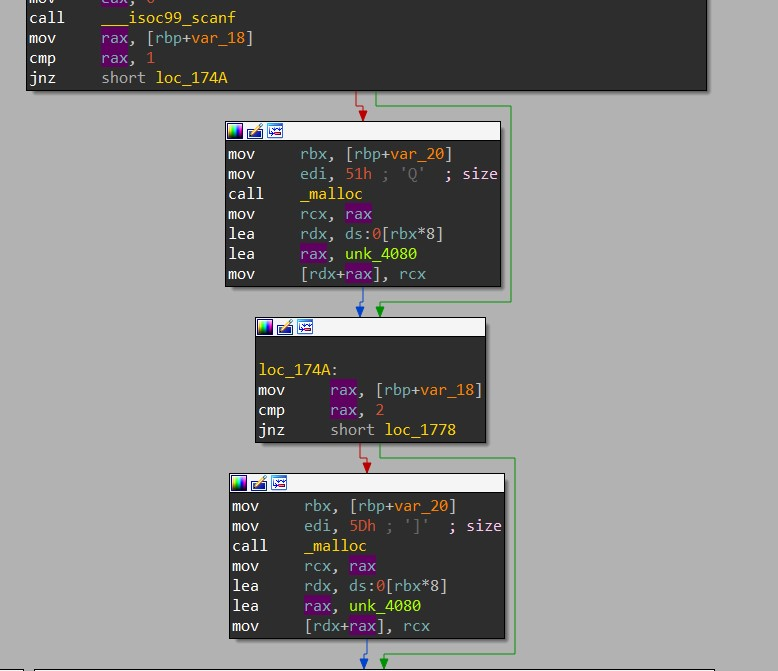
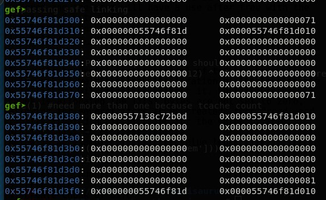
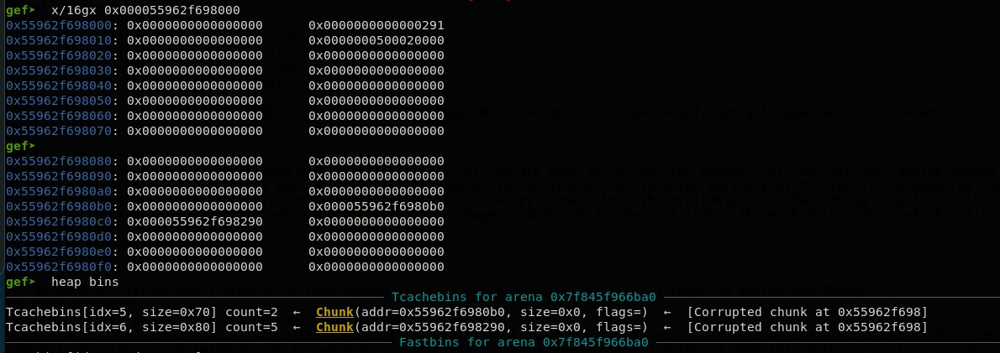

<!-- borrowed from https://github.com/m3ssap0/CTF-Writeups/blob/master/template.md -->

# CUCTF 2020 - DR-Xorisaurus

* **Category:** Binary Exploitation
* **Points:** 484
* **Solves:** 1

## Challenge

### Description
A binary was given along with libc 2.32 and a corresponding ld file.

### Files
 * dr_xorisaurus
 * ld-2.32.so
 * libc.so.6

## Analysis
Given that the libc given is 2.32, we can mostly assume that this challenge will involve the heap and we will need to take into account the new protection mechanism of safe linking utilized in it, more can be learned about it [here](https://research.checkpoint.com/2020/safe-linking-eliminating-a-20-year-old-malloc-exploit-primitive/). The brunt of it is that any usual heap leaks will be xored by their location in memory, this basically protects against blind overflows/overwrites.

Running the program we are given 4 options:

1. Fill beaker(create chunk)
2. Collect Data (read chunk)
3. Drain Beaker (free chunk)
4. Swap chemicals (frees then creates chunk, with 8 byte write)

Looking through the disassembly of these options shows an interesting operation in the swap chemicals function. First a counter is incremented on entrance into the function, meaning we only get to call this function 2 times. Second, after the chunk is freed the user has a choice of "two sizes to malloc", or so they want you to think. The input is compared to 1 or 2, but if a different value is sent in, both mallocs will be ignored completely ignored and the user will have a use after free with the remaining 8 byte write.



This will be useful to get control of tcache, but will only work if we first know the location of the heap as the safe linking will limit us without it. Luckily when a chunk is allocated the first bytes are not set to zero, allowing for several items to be created, then freed, and finally created again allowing for the value of the previous list to be leaked.

Below is an example of what the value looks like in the heap:  

1. Create 2 chunks of 0x70
3. Free both
4. Create chunk of 0x70
5. Read chunk



After doing this, we get something like this in the heap. The value in 0x55746f81d380 points to 0x55746f81d310, this is done by taking the address it is pointing to and xoring it by the current address shifted right by 12 bits. The fact that the value is offset by 3 nibbles, allows for the opperation to be reversed quite eazily.

```c
leak = 0x557138c72b0d
leak = leak ^ ((leak & 0xfff000000000) >> 12)
leak = leak ^ ((leak & 0xfff000000) >> 12)
leak = leak ^ ((leak & 0xfff000) >> 12)
leak = leak & 0xfffffffffffff000
```

This will set `leak = 0x55746f81d000`, or the base of the heap. With the ability to get a uaf, and get leaks we should be able to exploit the program.

## Exploit
With the ability to get the heap base and by utilizing the uaf, we are able to corrupt the tcache list, and get overlapping chunks for further exploitation. The method I went with was to just overwrite the tcache list location entirely, at the top of the heap. By taking control of this list we effectively can control the address for every chunk within the available size. Everything else just falls into place and takes place like other heap exploits. Here is an image of what the tcache list looks like with full control of this list:<b />




1. We need to fill up the tcache so we have enough values to work with when we start allocating exploitive chunks.
2. Leak the heap
3. Abuse UAF to get a chunk inside the tcache metadata
4. Overwrite the pointers with two values, the address back to this tcache location and the address before a first chunk. This can be overwritten with a size large enough to cause an unsorted bin chunk to appear, upon freeing.To make this work correctly specific sizes and addresses need to line up correctly.
5. Free this "larger" chunk
6. Leak the libc address
7. Overwrite the tcache list once more, with the string `"/bin/sh\x00"` and a pointer to `__free_hook`
8. allocate free hook and overwrite with system
9. Finally free that chunk and enjoy your shell, this needs to be done through the swap function. As only one free is done after the first swap and this was done to get the libc leak.

## Notes
Going into this challenge was my first time seeing libc 2.32 and it threw me off a bit. Overall this challenge isn't too difficult and isn't too different from previous exploits. The parts I was probably stuck on the longest was leaking the heap, but as I showed above it just takes a little bit more math than what was needed previously. The author for the challenge put out a solution also which takes a different approach than I do, by using scanf to consolidate some chunks inside the fastbin, you can find that write up [here](https://www.willsroot.io/2020/10/cuctf-2020-dr-xorisaurus-heap-writeup.html)

Lastly on the remote server there was a brute force avoidance mechanism, which required the user to generate a semi-matching sha256 hash. The author uses a python library called proofofwork to generate the hash, unfortunately my system/vm does not support this library? Instead I just iterate through a couple million numbers until a match is found or fail and attempt run again.
