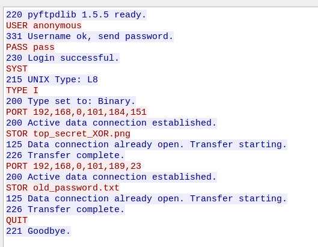
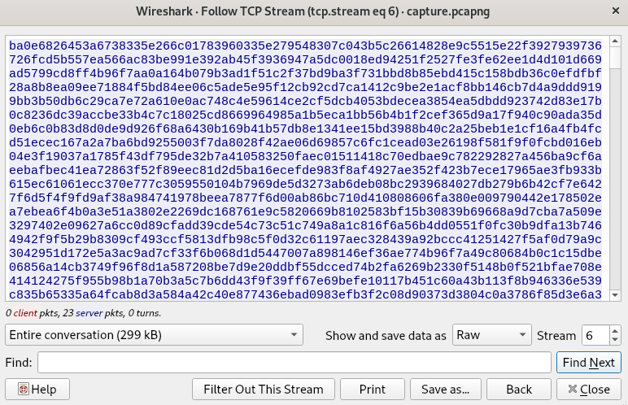
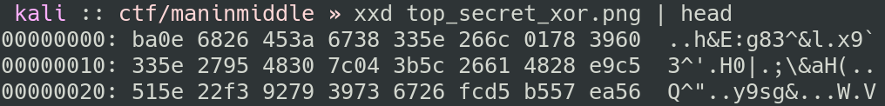

# Men in Middle

- Category: Forensics
- Points: 200 (125)

## Challenge

### Description

The description talked about two secret agents sharing files, and asked us to decode.

### Files

- `capture.pcapng`

## Solution

Looking in the PCAP file given, there are several things of interest to look at. Filtering out TLS traffic with `tcp and !(tls or tcp.port==443)` (after briefly searching for any SSL/TLS keys with `.log` ), we find FTP traffic and a conversation.

The FTP-control traffic appeared as follows (`ftp` filter):



Looking at this, we know that "pass" as password is likely not going to be useful for anything, so our next goal is to find `top_secret_xor.png` and `old_password.txt`, which may or may not serve as the XOR decryption key.

The other streams of interest contained the binary data of `top_secret_xor.png` and `old_password.txt` (which you could find by just looking through each stream, or calculating the port based on the `ftp` traffic):



This stream contained `old_password.txt`:


The final interesting stream contained this:


So we can conclude that the XOR decryption password is __eight characters__, just like the previous password.

Exporting the raw data from Wireshark for the image, we can calculate the XOR key based on what bytes _should_ decrypt to compose the PNG header.



The first sixteen hexadecimal characters, or the first eight ASCII characters (`ba0e6826453a6738`), *XOR* with the standard PNG header (`89504e470d0a1a0a`) to produce `335e266148307d32`, which in ASCII is `3^&aH0}2`.

Now, assuming this is the password since it's eight characters, we need to make a python script to decode the file.

```python
#!/usr/bin/env python3
key = bytes("3^&aH0}2", 'ascii')
data = bytearray(open('top_secret_xor.png',  'rb').read())
decrypt = data
for i in range(len(decrypt)):
    decrypt[i] ^= key[i % len(key)]
open("flag.png", "wb").write(decrypt)
```

Running this gives us `flag.png`:


Running `strings` on this file shows that there's a hexadecimal string at the end of the file:


Decoding this gives us our flag.

### Flag

`HTB{l3ts_rAiD_ar3a_51_br0s!!!}`