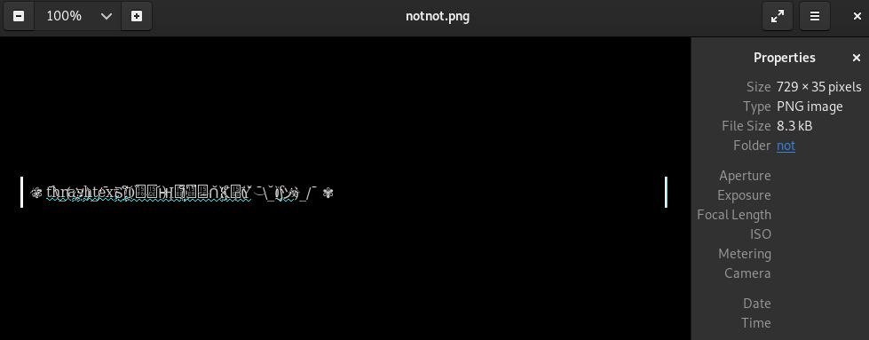
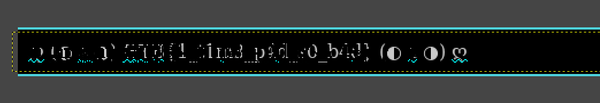

# Not

- Category: Crypto
- Points: 200 (100)

## Challenge

### Files

- `not.png`
- `notnot.png`

## Solution

We are given two files:

`not.png`

And `notnot.png`:

Looking at these and their names, it's fairly obvious that we need to do some kind of pixel manipulation to reveal the flag.

We overlay them in GIMP, color all white text in the second one black, overlay them, and squint really hard.

### Flag

`HTB{1_t1m3_p4d_s0_b4d}`