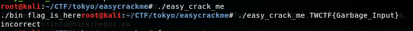
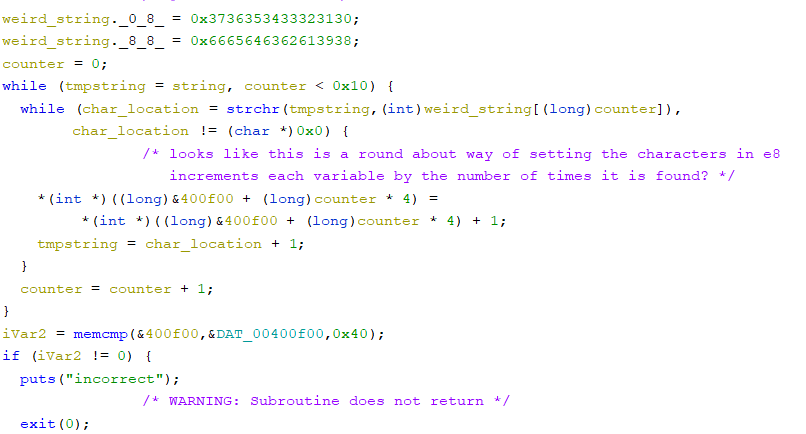
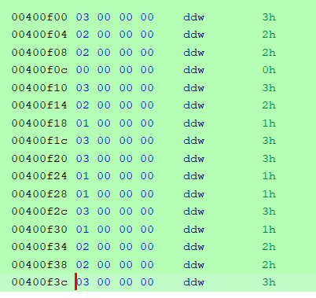
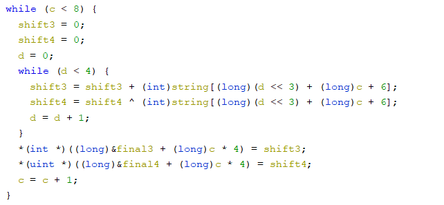
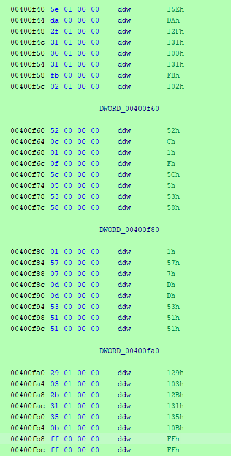
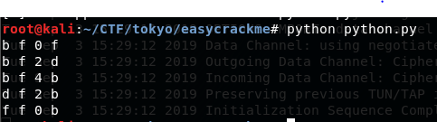

<!-- borrowed from https://github.com/m3ssap0/CTF-Writeups/blob/master/template.md -->

# TokyoWesterns CTF 2019 - Easy Crack Me

* **Category:** reverse
* **Points:** (dependant on solve time)

## Challenge

Only a single file is included easy_crack_me 
On running the program we see that we `./bin flag_is_here` so we need to input the flag as an argument.



## Solution/
To practice our Ghidra skills lets use it, opening it up we find that there
After finding main and venturing to the code we see that we do need two arguments with the second stored locally. Then we have a couple compares, first is the check that the length is 0x27 characters or 39 in decimal. Then we check to see if the first 6 characters are 'TWCTF{' and that the last character is '}'


That means we have 32 characters to worry about. Moving onto the next stage we see a string being loaded into memory again with some loops after. The string appears to be the hex alphabet `0123456789abcdef` and the first loop increments 16 times, the same as the length of our new string in memory, then the second uses strchr, for those of you who do not know what this is all it does is return the memory location in the string where the first location of the character is found. So the second loop keeps going while the current character is 
found in our flag, if it is found we increment a counter on the stack offset by the current iteration of the first loop.



So now we take these counted up values on the stack and compare them to memory located at 0x400f00, if we go to this memory location and make it look nicer by converting all the data to dwords we see the pattern compared to



So this means that whatever we input we give the program expects to find each character this many times:
```
0:3
1:2
2:2
3:0
4:3
5:2
6:1
7:3
8:3
9:1
a:1
b:3
c:1
d:2
e:2
f:3
```

Now we start to get to the fun parts.


Don't worry about my custom naming for the variables too much since they were temporary and not too helpful. So anyway, we have to more loops one with 8 iterations and the second with 4, so 32 total iterations. We see two math operations happening an add and a xor, the offset of 6 is to get past the `TWCTF{` and the `<<2` is to get the current set of 4 characters we are working with. So we see that every 4 characters are being added together and seperately xored together. Then stored locally again for use later on.



Next we have a very similar set up to the batch earlier except for one difference, `<<3` instead of `<<2`. This small difference changes every 4 characters into a group to every eigth character into a group, ie `7,15,23,31; 8,16,24,32; etc`. At least the same math operations are happening on these groups though.


Finally we have some compares for the data. As we can see we have 4 memcmp's happening, the first is for the first set of 4's being added together and this memory is stored at 0x400f40, then the second is also for the set of 4's being xored together and this memory is stored at 0x400f60. The next two they try to swap them on us and store the added values of every eigth character at 0x400fa0 and the xored at 0x400f80. So looking in memory we see the pattern needed for completion.



```
All of the characters would normally be at index 6 or 7, but we are going to ignore the TWCTF for this section.
Added together:
	0+1+2+3=0x15e
	4+5+6+7=0xda
	8+9+10+11=0x12f
	12+13+14+15=0x131
	16+17+18+19=0x100
	20+21+22+23=0x131
	24+25+26+27=0xfb
	28+29+30+31=0x102

	0+8+16+24=0x129
	1+9+17+25=0x103
	2+10+18+26=0x12b
	3+11+19+27=0x131
	4+12+20+28=0x135
	5+13+21+29=0x10b
	6+14+22+30=0xff
	7+15+23+31=0xff

Xored Together:
	0^1^2^3=0x52
	4^5^6^7=0xc
	8^9^10^11=0x1
	12^13^14^15=0xf
	16^17^18^19=0x5c
	20^21^22^23=0x5
	24^25^26^27=0x53
	28^29^30^31=0x58

	0^8^16^24=0x1
	1^9^17^25=0x57
	2^10^18^26=0x7
	3^11^19^27=0xd
	4^12^20^28=0xd
	5^13^21^29=0x53
	6^14^22^30=0x51
	7^15^23^31=0x51
```


So now we have a rough idea of what everything should equal once it is in place.
The next loop helps us narrow down what will go where with more precision.


Here this loop goes through the string and checks to see if the character is a `0-9`, `a-f`` or `else`, and if these the value 0xff, 0x80, 0x00 is set respectively. Then the memory is then checked at 0x400fc0 so we can get the list of character order.
```
char
char
num
char
num
num
num
num
char
num
num
char
char
num
num
char
num
num
char
num
char
char
num
num
num
num
char
num
num
num
char
num
```
Now we even know what the order of characters looks like.
The next loop while loop checks every other character and makes sure that the total is equal to 0x488, but I forgot about this loop and didn't take it into consideration when I figured this out, So ...


Yeah, here we have a final check for specific characters in specific spots. So now we have a starting point also. Now to put all of this together you could have made a program to get it all done, but I did not think of a good way to do that, so I used an excel sheet and a simply python script to figure everything out.


I made a couple cells with all the math needed and all I needed to do was input the correct characters and find 0's accross the board and we are good to go. As for the python script all this does is print out all the possible combinations for each set of 4.



Here we can see that the first index is either a bdf, the third is 024, and the last is bdf. Now this isn't a glamorous way of doing this but after getting a list of all the possible characters for each they start to cancel each other out. On the excel image on the right side I have a list some of the possibilities, after a while everything just starts to come together. As long as you don't do anything stupid like deleting a possible solution causing you to mess up an hour later then having to start over. But who would do something stupid like that, haha.

## Flag
Anyways, here's the flag:

```
TWCTF{df2b4877e71bd91c02f8ef6004b584a5}
```
