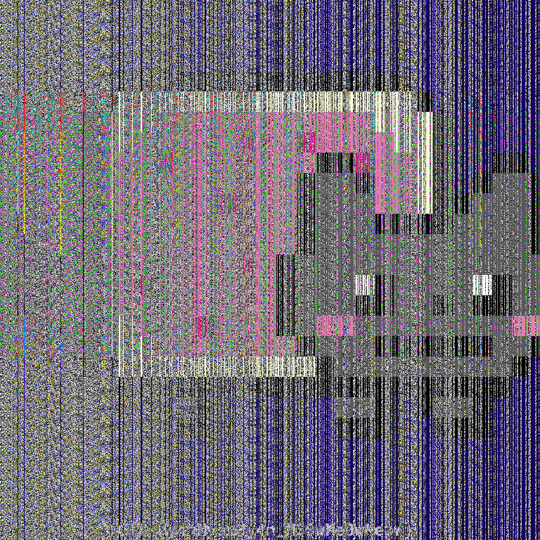
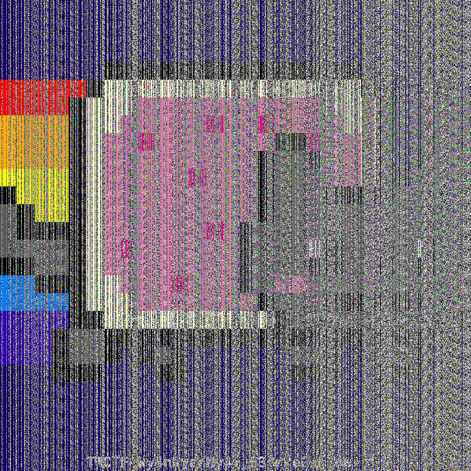
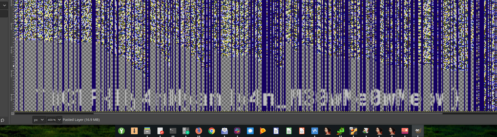

<!-- borrowed from https://github.com/m3ssap0/CTF-Writeups/blob/master/template.md -->

# TokyoWesterns CTF 2019 - Meow

* **Category:** reverse
* **Points:** (dependant on solve time)

## Challenge

A 7zip archive was provided, along with an ASCII art picture of a cat.

## Solution

The 7zip archive contained two files:
 * meow.n
 * flag_enc.png

The `meow.n` file was a [NekoVM](https://nekovm.org/) executable.  Running it produced...

```
andrew@WOPR /tmp/meow % neko meow.n
Usage: meow INPUT OUTPUT
```

When run with `flag_enc.png`, it produced a similarly broken image.

We couldn't immediatly find any tools for RE'ing NekoVM executables, so [@BaileyBelisario](https://github.com/BaileyBelisario) wrote a script to keep feeding the output image back in as input, saving each file along the way.

```bash
#!/bin/bash

#neko meow.n flag_enc.png flag_dec0.png

for ((i = 1 ; i < 10000 ; i++)); do
  let k=$i-1
  neko meow.n flag_dec$k.png flag_dec$i.png
done
```

Eventually, some of them started to look like a Nyan Cat image (although still severely broken).  However even after several thousand iterations they never became clean enough to read.

### Iteration #2098


### Iteration #2108


On a whim I opened one in GIMP, and carefully deleted all of the incorrect pixels around the flag.  To my suprise, it was just enough to make it readable!



## Flag

```
TWCTF{Ny4nNyanNy4n_M30wMe0wMeow}
```
